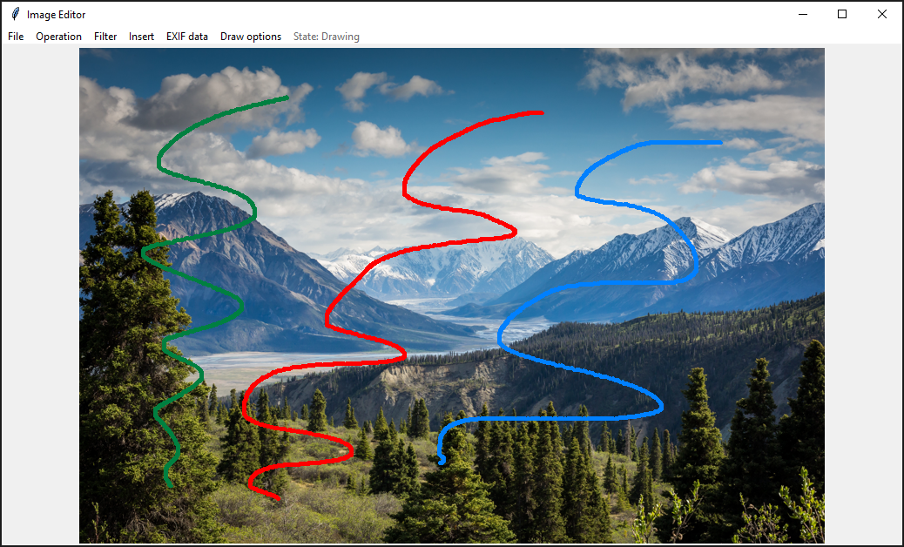

# image_editor
---------------------------------------------------------------------------

### Description
This Python desktop application is a simple image editor. It allows cropping, resizing, orientational changes, EXIF data viewing/removal, annotating, inserting of additional images, and the application of filters to images.

### Screenshots

  
  &nbsp; &nbsp; &nbsp; &nbsp;
  

  
  &nbsp; &nbsp; &nbsp; &nbsp;
  

  

(*full size images can be found [here](./screenshots)*)

### What was learnt
The focus for this project and the main learning points were to practice, and become more proficient with, object oriented Python, working with images (using the Pillow Python module) and creating desktop applications using Python (via the Tkinter module).

### Application instructions

The application is operated via the menu bar (shown above). The instructions given (such as File/Open) will involve selecting the options in the menu and the subsequent option in the available dropdown.

#### Menu options:

1. **File:**

- **Open** - Opening an image with the application requires clicking File/Open and selecting the file you wish to open.
- **Save** - Saving this way overwrites the originally open image with the current image on the canvas. Done via File/Save. (Currently bugged, will also capture the confirm save dialog box)
- **Save as...** - Saves the current image state with the name given by the user (done via File/Save as...).

2. **Operation:**

- **Rotate 90°** - Rotates the current image 90° to the right.
- **Flip left-right** - Flips the current image around its vertical axis.
- **Flip top-bottom** - Flips the current image around its horizontal axis.
- **Crop** - Allows the user to crop a section of the current image. After selecting the crop option (Operation/Crop), the user can click on the current image to mark the top left corner of the new image. A red square will appear and move with the cursor to show what the new image will contain. Clicking a second time to denote the bottom right corner of the new image will complete the operation.
- **Resize** - Allows the user to resize the current image. Two text input pop-ups will appear one after the other to allow the user to enter the desired new dimensions of the image.

3. **Filter:**
- The four options available under this option each apply a different filter to the current image, either sharpen, blur, black & white or emboss (demonstrated in screenshot 5).

4. **Insert:**
- **Shape** - The user can insert a shape by selecting the desired one (line, oval or square). Each shape requires two clicks of the left mouse button on the image where the shape is desired. For the square/rectangle that is the top left and bottom right corners, for the line that is the start and end of the line, and for the oval that will be the same as the square/rectangle with the oval drawn on its inner edge. The shape is rubber banded while inserting to allow the user to see what will be added.
- **Image** - By selecting this option the user can add another image to the canvas. After selecting the option the user clicks on the current image to mark the centre of the new image. A pop-up will then appear to allow the user to specify a size. (For simplicity only square images can currently be added).
- **Footer** - Inserts a small footer at the bottom of the image allowing the user to add text to an image.
- **Line colour** - Allows the user to select the colour of shapes that are inserted.
- **Select line width** - Allows the user to select the line width of shapes that are inserted.

5. **EXIF Data:**

- This allows the user to view (EXIF Data/View) or remove (EXIF Data/Remove) EXIF data from the current image.

6. **Draw options:**

- **Draw** - The 'Draw' option under 'Draw options' header enables/disables drawing. When clicked a check will appear next to the option and the state display will reflect that you are in drawing mode. Holding down the left mouse button and dragging the cursor over the current image will draw on the image.
- **Select colour** - Allows the user to select the colour that will be used for drawing.
- **Select pen width** - Allows the user to select the pen width that will be used for drawing.
- **Remove drawing** - Removes all drawing (not saved) from the image.

The last element of the menu bar is a state display. This allows the user to confirm when they are cropping, drawing etc.

### How to use

To run the code, after cloning the repository running 'main.py' will start the application. This can be done either via an IDE such as PyCharm or via the command line.

#### Requirements:
- Python 3 (and the included Tkinter module)
- Pillow (PIL), installable with the following CLI commands:

>`python3 -m pip install --upgrade pip`

>`python3 -m pip install --upgrade Pillow`

### License
This is a demonstration project and not intended for collaboration, as such a license has not been added meaning the default copyright laws apply and no one may reproduce, distribute, or create derivative works from this work.
